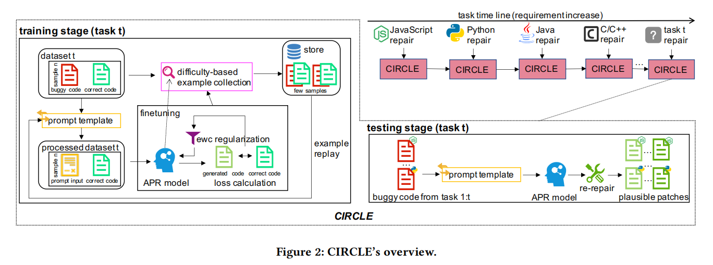
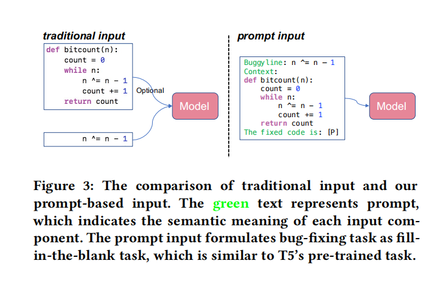

# ISSTA 2022 CIRCLE: Continual Repair across Programming Languages

## 摘要和引言部分

基于深度学习的自动程序修复从已有的程序语料学习修复模式。

DL-Based APR 包含两个部分(encoder-decoder 架构):

- encoder: 抽取缺陷代码和必要上下文的语义并表示为一个固定长度的向量
- decoder: 接受 encoder 编码的向量输出正确的代码

把 APR 作为一个 Neural Machine Translation 任务

一些现有的方法：

- 采用经典的 NMT 模型
- 使用两个 encoder 分别来编码 buggy code 和 上下文
- 编码器中使用 GPT

现有方法的局限：

- 跨语言能力受限
- 离线学习的方式，无法持续接受新的数据，这对 APR 在真实场景的应用造成了阻碍；传统 APR 模型在新的任务上学习之后会遗忘在之前的训练过程中学到的知识。

CIRCLE Solution:

- T5-base model、prompt template、re-repairing 机制
- rehearsal method 和 elastic regularization

prompt: 

prompt 是一串 token，这些 token 会被插入到输入中，来把初始任务表示为语言模型的训练任务的形式。prompt 填补了预训练任务和 downstream task 之间的 gap，使微调变得更容易。本文参考了 Raffel et al. 和 Khashabi et al. ，设计了一组前缀 prompt

Continual Learning: $f_t$ 是在第 $t$ 个任务上训练得到的模型，接收第 $t+1$ 个任务的数据集 $D_{t+1}$来更新 $f_t$，期望得到 $f_{t+1}$ 在第 $t+1$ 个任务上的表现尽量好。

Continual Learning 和 MultiTask Learning 的区别是后者每次新加一个任务就需要在全部的历史数据集上进行重新训练。MultiTask Learning 适用于那些比较稳定的任务，而 Continual Learning 适用于那些数据持续迭代的任务。Continual Learning 的主要挑战是遗忘效应，即忘记之前在历史数据集上学到的知识。

解决遗忘效应的三个主要手段是: Rehearsal，Regularization，Architectural method.

Rehearsal 方法采集历史数据集的某一部分，在后续的训练中会继续使用；

Regularization 方法对模型参数的更新做限制，限制的模型的复杂度；

architectural 方法尝试动态调整模型的模块，模型的参数会随着任务的增长而动态扩增。

CIRCLE 采用的是 rehearsal 和 regularization 的混合方法。

## CIRCLE 的方法

CIRCLE 包括两个 stage，train 和 test. 在 train stage 先使用 prompt function 把输入转化成 fill-in-the-blank 的形式。我们的训练集包括当前 task 的数据集和从历史数据集中采样的部分数据。然后这些数据被输入到 T5-based model 进行训练。我们保留了原始的 token 来建立词典，而不是像某些方法使用 BPE 算法来得到新的词典。接着 T5-based APR model 根据 prompted 的输入生成一系列候选的修补方案，使用损失函数来进行评估。

为了缓解遗忘效应，在更新参数的时候需要小心。因此，我们使用了 EWC 正则化来计算每个参数对之前的任务的重要性，在更新参数的时候，需要避免对重要的参数做太多更新。最后基于 loss 和 EWC 正则化来更新参数。

当训练收敛的时候，我们通过一种特殊的方法来选择当前任务的训练集的一部分子集，存到存储中，作为未来再次使用的数据。

在推理阶段，APR model 接受所有的 buggy code 输入然后进行修复，生成候选的修补方案。在多语言的场景下，模型很可能生成不同语言中语义相近的关键字，比如 C 的 NULL 和 python 的 None。

我们简单地通过映射的方法对输出做修正。

## 基于 Prompt 的数据表示

输入包括两个部分：buggy code 和 surrounding context

传统的方法通过分别 encode 这两个部分然后把嵌入向量拼起来。

最近 Raffle et al. 提出了一种新的方法，通过把不同的输入拼上某些前缀来得到 prompted 输入，这种方法被证明有利于 downstream task 的微调。

根据这种思想，我们手工设计了 prompted template 来把 buggy code 和 context 转换称 fill-in-the-blank 的形式。

用 "Buggy Line: " 和 "Context: " 来指示 buggy code 和 context，使用 "the fixed code is: " 来指示根据前面的输入生成修复后的代码。 

由于 T5 是在自然语言上的 fill-in-the-blank 进行与训练，因此在 prompted 的输入上进行微调是更加自然的。

我们使用 sub tokenization method 来处理 OOV 问题。

我们没有使用新建立的 vocab，因为我们想尽量利用 T5 预训练的知识，而且 token 在整个语料上的频率也无法得到。

## 基于 T5 的模型架构

T5 是一个 encoder-decoder 架构的 transformer 模型，在超过 750 GB 的语料上训练，研究表明它在代码相关的任务上也有不错的表现

T5 的 encoder 是一些列 transformer block，decoder 也有类似的结构，但是在每个 self-attention 之后使用了注意力机制，这样就可以在 encoder 的输出上 attend。

> In addition, the attention is causality enabled to avoid information leaking during decoding.
>
> 这句什么意思不太懂

文章中使用 t5-base 作为训练起点。

## 基于难度的训练样例重用

直觉：那些在前面的任务训练中表现不好的数据通常更容易被遗忘。

因此我们基于这样的标准选择:
$$
d_t(x^{i}_t, y^{i}_t) = \frac{L(x^{i}_t, y^{i}_t \mid \theta_t)}{\mid y^{i}_t\mid}
$$
$d_t$ 表示在第 $t$ 轮训练之后得到的模型对数据的困难度，分母是正规化因子，因为长代码通常容易得到更大的 loss, 基于这个标准选择 N 个数据加入保留数据集 $E_t$

我们在第 $t+1$ 个任务的训练过程可以表述如下：
$$
\theta_{t+1}= \underset{\theta_t}{argmin} \underset{(x,y)\in D_{t+1}\cup E_{1:t}}{\sum} L(x, y | \theta_t)
$$

## 基于采样的 EWC 正则化

为了减缓遗忘效应，CIRCLE 采用了 EWC 正则化，通过对 “重要”的参数更新做惩罚，来限制对这些参数的更新幅度。通过 Fisher 矩阵来计算参数的重要性。
$$
F_i = \bigtriangledown^2 L(x,y|\theta_{t-1,i})\\
EWC(\theta_t) = \underset{i}{\sum} \lambda F_i(\theta_{t,i} - \theta_{t-1,i })^2
$$
由于 $F_i$ 直接计算会带来扩展性的问题，因此我们只从 sample 的 data，也就是 $E_{1:t}$ 抽样 $M$ 个数据来计算，因此，训练过程可以被进一步写为.
$$
\theta_{t+1}= \underset{\theta_t}{argmin} (EWC(\theta_t) + \underset{(x,y)\in D_{t+1}\cup E_{1:t}}{\sum} L(x, y | \theta_t))
$$

## 跨语言的再修复

经过了训练的过程，模型已经学习了修复程序的潜在模式，能够生成正确的代码。

但是依然面临以下三个问题:

- keywords mismatch: 生成了别的语言中语义相近的关键字，比如 Java 程序中生成了 None
- format mismatch: 多了空白符导致语法错误，比如 == 生成成 = =
- OOV: 有些特殊符号被当作 unk

解决办法:

- keywords mismatch: 建立一个简单的 map table
- format mismatch: 使用正则表达式来去除多余的空格
- OOV：用特殊的符号替代 unk

## 实现细节

训练阶段:

使用 pytorch 编写模型代码

使用 huggingface 的 T5 实现，选择 t5-base

使用 AdamW 优化器，学习率 3e-4

在每个 task 上最多 train 20 个 epoch，采用 early stop ，validation loss 3 个 epoch 不下降就结束

bacth_size: 64, max_input_length=512, $\lambda: 11000$, $\mid E_{1:t}\mid = 20000$ 

> In inference stage, we use beam search with 250 beam size. Meanwhile, we apply top-k and top-p sampling during each step’s token selection. Then, we re-repair the generated patches using the map ping table mentioned in Section 3.6. As a result, at most 1000 candi date patches are created by CIRCLE. For evaluation purpose only, following previous works [25, 45], three authors manually verify plausible patches (i.e. patches that successfully pass the test) based on ground truth patches (i.e., developer patches). And the plausible patches is considered to be correct only if all three authors agree it is equivalent to ground truth data semantically. All the training and evaluation of our methods are conducted on one CentOS 7.7 server with eight Tesla V100-SXM2 GPUs.
>
> 开头那段没看懂，先抄原文 mark 一下
