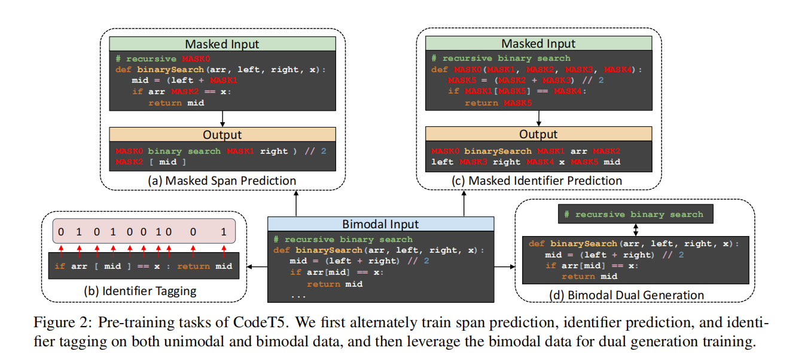

# Code T5

## Introduction

近年来，预训练语言模型大行其道，研究者发现在代码相关的任务上使用预训练语言模型也取得了不错的效果。但是现有的研究仅仅将代码考虑为像 NL 一样的 token 序列，忽略了 PL 本身带来的信息。

本文的贡献:

- unified encoder-decoder model
- identifier aware pretraining objective
- leverage NL-PL pair

## CodeT5

### Encoding NL and PL

模型可以接受两种输入，对于 NL-PL 输入，我们把输入序列拼起来，用 SEP 分隔两个序列，即表示为如下形式:
$$
x = ([CLS], w_1, ..., w_n, [SEP], c_1, ..., c_m)
$$
其中 n 是 NL 的序列长度，m 是 PL 的序列长度，当输入为 PL-only，NL 序列部分为空。

为了更好地捕获代码相关的信息，作者利用了代码中的类型信息，更具体来说，标识符(函数名和变量)。把 PL 片段转换成 AST，然后抽取出每个 node 的 type，为每一个 PL 片段，生成一个 label $y \in \lbrace 0, 1\rbrace ^m$，标识每个 token 是不是 identifier.

### Pretraining Task

#### Masked Span Prediction

盖住一段 NL-PL 段，预测缺失部分的内容

#### Identifier Tagging

预测每个 token 是不是标识符

#### Masked Identifier Prediction

盖住所有标识符，预测内容
